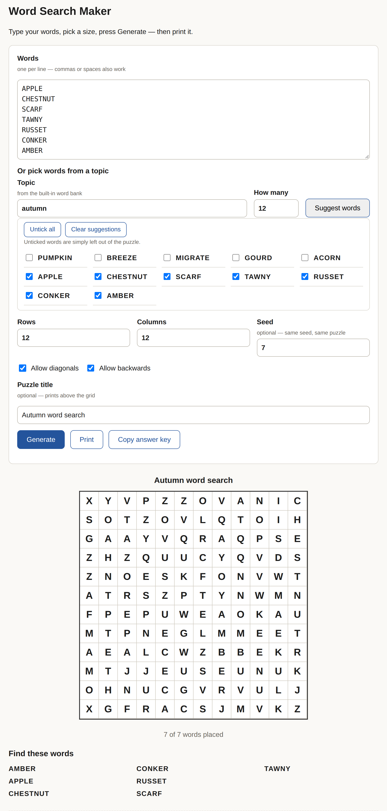

# wordsearch

Make printable word searches: give it a list of words, choose the grid size, and
print the puzzle — with an answer key on a separate page.

Two ways to use it:

- **Web app** — `web/index.html`. One self-contained page, no install, no internet needed.
- **Command line** — `wordsearch.py`. Turns a word list into a grid plus a coordinate answer key.

Opening it, printing it, and the full list of inputs are further down.

**Try it in your browser:** <https://retnoika.github.io/wordsearch/> — nothing to install, works on desktop, tablet and phone.



## Usage

```bash
python3 wordsearch.py --size 12 MOON LANTERN STAMP LETTER
python3 wordsearch.py --size 12 --diagonal --backwards < words.txt   # one word per line
python3 wordsearch.py --size 10 --seed 4 --diagonal --backwards LANTERN STAMP LETTER
```

- `--size` grid size (default 12)
- `--seed` reproducible grids — same seed and word list always give the same puzzle
- `--diagonal` adds both diagonal directions
- `--backwards` adds reversed placements
- `--words` from argv, or one per line on stdin

Output: letters grid, then a coordinate list per word (the answer key).

## Known limits

- Words must fit inside the grid (`len(word) <= size`) or they are skipped silently;
  the final line reports `placed/total` so check it.
- Filler letters are random uppercase — later vowels may accidentally complete a word.
- Plain-text output only — for a printable page, use the web app below.

## Web app

`web/index.html` is a single self-contained page — all CSS and JavaScript are
inline, with no frameworks, no CDN, and no build step. Double-click it (or open
it in any browser); it works straight from disk and offline. It follows the same
placement rules as the CLI: longest word first, up to 500 placement attempts per
word, a cell may be shared only when the letters match, and leftover cells get
random letters.

Inputs:

- **Words** — one per line; commas or spaces also work. Everything is
  uppercased, stripped of non-letters, and de-duplicated.
- **Or pick words from a topic** — type a topic (e.g. autumn, tea, space) and
  tick suggestions from a built-in offline word bank, so coverage is limited to
  the topics bundled in the page; the words you tick drop straight into the list.
- **Rows / Columns** — grid size, 5–30 each (default 12 × 12).
- **Allow diagonals / Allow backwards** — which directions words may run.
- **Seed** — optional. The same seed with the same inputs always rebuilds the
  identical puzzle; leave it blank for a fresh puzzle on every click.
- Words that cannot be placed are listed on screen ("Not placed") with a reason,
  never silently dropped, and stray extra spellings created by the random
  letters are flagged.

Printing (the Print button, or the browser's print dialog) gives A4 pages: the
grid and word list on the first page, the answer key on its own page, with the
form controls hidden. Rows and columns in the answer key are counted from the
top-left, starting at 1.

## How to open it (fastest first)

**1. Straight from GitHub — nothing to install**

1. Open the repository page and click into `web/index.html`.
2. Click **Download raw file** (the download icon at the top right of the file view).
3. Double-click the downloaded `index.html` in your Downloads folder — it opens in your browser. Bookmark it or drag it to the Dock. It works offline from then on.

**2. Download the whole repo as a ZIP**

Green **Code** button → **Download ZIP**, then unzip and open `web/index.html`.

**3. With git**

```bash
git clone git@github.com:retnoika/wordsearch.git            # SSH, if your key is set up
# or clone over HTTPS — if the repository is private, GitHub asks for your
# username plus a personal access token instead of a password
cd wordsearch
git pull                     # later, to pick up changes
open web/index.html          # macOS; use xdg-open on Linux
```

**Printing:** with a puzzle on screen press **Print** — A4 paper, page 1 is the puzzle, page 2 is the answer key. Choose "Save as PDF" if you would rather keep a copy.
